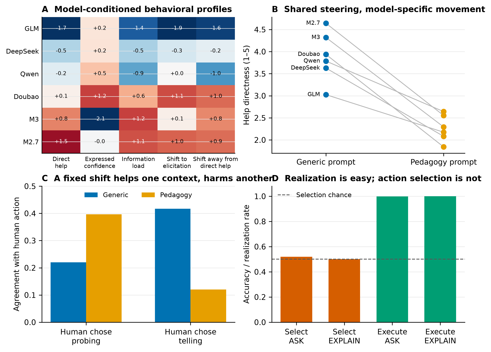
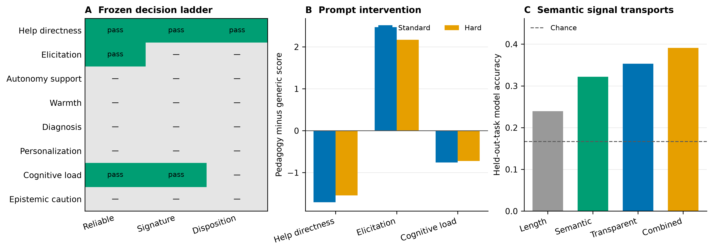

# Beyond Personality and Fingerprints: Behavioral Evidence for Pedagogical Policy Signatures in AI Tutors

> Working draft. Supplementary design, technical attrition, and audit details
> are in `appendix.md`.

## Abstract

Questionnaire studies of language-model personality are vulnerable to prompt
fragility, socially desirable response bias, and a widening self-report--behavior
gap.  We instead study *pedagogical policy signatures*: recurring,
model-conditioned teaching actions measured in authentic educational responses.
Across 31,638 paired responses from six models and six teaching arms, transparent
policy features identify the model on held-out teaching families (0.242 accuracy
versus 0.167 chance), but general tasks yield even stronger attribution.  This
shows why generator fingerprinting alone is not construct validity.  In an
archive-only screen of 123,468 free-form responses, organizational style is
more stable across non-tutoring tasks than any candidate general-personality
manifestation; no content candidate jointly passes recurrence and transport to
default tutoring. An archive-selected prospective affiliation pilot nevertheless
finds a reliable default open-behavior profile across educational and non-
educational conflicts (rho=0.900) and one irrelevant-context perturbation
(rho=0.718), plus a 1.689-point high/low prompt effect. Standard self-report is
negatively related to open behavior (rho=-0.200) and forced choice is at ceiling,
supporting a prompt-contingent behavioral cluster rather than Big Five
equivalence. Separately, in a nine-model, 26,586-response MathDial panel,
the same explicit pedagogy instruction
causes every model to ask more questions and produce shorter turns, while reducing
cross-model policy dispersion to 0.763 of baseline (95% bootstrap CI [0.738,
0.794]).  A conventional classifier trained on 18,541 existing human-labelled
teacher turns finds improved human next-action agreement for all nine models
under three measurement variants, but agreement collapses when the human teacher
selected direct `telling`, revealing contextual oversteering.  Transparent policy
features improve leave-one-model-out tutoring-quality AUC by 0.023--0.031 beyond
exact-item controls, whereas length adds about 0.002.  Conversely, on 6,000
LongTutor model--history pairs, adaptive-teaching scores do not improve human-gold
diagnosis or reference-grounded historical-evidence prediction beyond exact-history difficulty.
In a prospectively frozen 2,560-response factorial, question and answer clauses
change validated target behaviors by 0.773 and 0.895, while a warm-tone clause
changes a frozen encouragement marker by 0.595; an independently ordered
640-response replication preserves all three operational effects, whereas
learner requests fail both registered adaptation gates. A blind three-judge
audit validates the question and answer detectors but rejects semantic warmth
for the marker. In a blinded
panel of 1,074 complete judge--batch annotations, semantic features
identify models on held-out educational tasks at 0.322 accuracy and reach 0.391
when combined with transparent features; prespecified gates retain help
directness and cognitive load as cross-task signatures, but only help directness
as a validated disposition. The evidence supports stable and steerable
pedagogical policy signatures in this finite model panel, not human-like
personality, and exposes both a cost of universal questioning prompts and a gap
between explicit policy control, learner-request adaptation, and accurate learner
modeling.

## 1 Introduction

Language models are often described as having personalities.  The empirical
support usually comes from asking them to complete human inventories or enact a
specified persona.  Those tests establish that models can *express* a profile;
they do not establish that the profile predicts behavior when the model tutors a
learner.  Recent psychometric audits strengthen this objection: small wording and
option-order changes destabilize questionnaire scores, broad factors collapse
toward socially desirable responding, and even internally reliable self-reports
often fail to predict open-ended behavior.

Educational agents offer a harder and more consequential test.  A tutor must
choose whether to explain or elicit, reveal an answer or preserve learner effort,
diagnose a misconception or remain cautious, and use or ignore prior history.
These choices are observable across repeated, authentic contexts.  They are also
not universally good: a Socratic question can be useful after a productive error
and obstructive when direct instruction is warranted.

We introduce a behavior-first hierarchy.  A *surface fingerprint* is any stable
authorship cue, including verbosity and formatting.  A *pedagogical policy
signature* is an interpretable teaching-action pattern that survives exact-item
and surface controls.  A *validated pedagogical disposition* is the narrower
subset that is reliable across measurement routes, recurs across educational
tasks, relates to an independent criterion, and responds coherently to a targeted
intervention.  This vocabulary is deliberately not a claim that models possess
human traits or inner mental states.

Our study uses a uniquely paired evaluation archive: the same benchmark items and
harness were run across multiple current model systems.  It combines four sources
of identification.  First, held-out-task analyses test recurrence beyond any one
benchmark.  Second, generic test-taking and instruction-following tasks expose
domain-general generator fingerprints.  Third, paired generic and explicit-
pedagogy prompts create a within-model, within-item intervention.  Fourth,
existing human teacher moves and human-gold learner-state tasks provide criteria
that do not depend on the main tutoring-quality judge.

The principal findings reject two simple stories.  The signal is not only length
or item difficulty, because policy features add held-out-model quality prediction
after both controls.  It is also not a universal beneficial personality: generic
tasks are easier for model attribution, approximate family resemblance is weak,
and an intervention that improves average action match systematically suppresses
appropriate telling.  Finally, adaptive-sounding teaching quality is only weakly
associated with objective diagnosis and adds no prediction beyond exact history.

## 2 Related work

### 2.1 From elicited personality to observed behavior

PersonaLLM shows that prompted models can reproduce designated Big Five profiles
in inventories and stories (Jiang et al., 2024), while TRAIT expands such probes
to thousands of scenarios (Lee et al., 2025). Reusens et al. (2025) test whether
assigned personas remain consistent across elicitation tasks. These are
expressibility or prompted-consistency results.
Shu et al. (2024) demonstrate substantial sensitivity to order and negation.
Recent audits challenge both construct equivalence with human personality and the
predictive validity of LLM self-report (Han et al., 2025; Zierahn et al., 2026;
Contreras, 2026).  Kocielnik et al. (2026) find greater coherence only when
constructs and behavioral contexts are tightly matched.  We therefore begin with
repeated tutor actions rather than a human inventory.  GenPT replaces fixed
self-report items with newly generated projective stimuli and a staged behavior-
collection pipeline (Wang et al., 2026), showing that behavior-first elicitation
is itself an active psychometric direction. Our unit is narrower: unassigned
defaults in shared-harness tutor outputs, tested against task, fingerprint,
intervention, and external-criterion controls.

### 2.2 Evaluating and steering AI tutors

MathDial defines teacher moves and the tension between learner opportunity and
premature solution reveal (Macina et al., 2023).  MRBench provides eight
learning-science dimensions (Maurya et al., 2025), and MathTutorBench shows that
subject expertise does not automatically imply tutoring skill (Macina et al.,
2025).  LongTutor reports a capability mismatch between historical evidence,
knowledge-state diagnosis, and adaptive teaching on long real-world histories
(Li et al., 2026).  We extend that setting with an exact-history, held-out-model
test of whether adaptive-teaching scores predict human-gold diagnosis.  Lee et
al. (2026) learn activation directions for tutor-specific variation from human
dialogue. ScaffoldLM and MHPO instead add learner-state planning and multi-horizon
optimization (Li et al., 2026; Shi et al., 2026). More broadly, this work asks
how a predefined policy can be induced; we ask first whether deployed systems
show recurring default differences and how a shared intervention changes them.
IHEval reports sharp degradation when instruction priorities conflict (Zhang et
al., 2025). Whether an explicit learner request survives system-level policy
clauses is therefore an instruction-hierarchy test, not evidence of empathy,
learner understanding, or pedagogical appropriateness.

Borchers and Shou (2025) ablate learner-context fields in 75 ITS scenarios and
find that three LLMs only marginally reproduce ITS adaptivity, while a validated
tutor-training classifier exposes overly direct feedback.  This is the closest
context-sensitivity study; we instead estimate cross-task default-policy
recurrence in a paired model panel and test whether adaptive presentation tracks
human-gold learner diagnosis.  PedRAG proposes runtime theory grounding to reduce
declared-versus-enacted pedagogical inconsistency (Nkambou et al., 2026), but its
reported mastery is from controlled multi-agent simulation.  We treat it as a
control architecture, not learning-effectiveness evidence.

Answer withholding is already studied under pedagogical jailbreaks, adversarial
student pressure, and a deployed machine-checkable help supervisor (Zhao et al.,
2026a,b; Pisan, 2026). A separate preregistered audit finds that general
helpfulness judgments can reverse between judges even when targeted pedagogy
contrasts persist (Fan et al., 2026). These results preclude first-withholding
claims and support our requirement for targeted measures and independent
criteria rather than one aggregate judge score.

### 2.3 Why attribution and simulation are insufficient

Lexical features identify generators across domains (McGovern et al., 2025), so
model attribution is a confound diagnostic rather than our endpoint.  Similarly,
prompted learner simulation cannot be assumed to measure learning.  Scarlatos et
al. (2026) find that simple prompted students perform poorly on linguistic,
behavioral, and cognitive fidelity.  We therefore use no naive simulated-student
claim.  The study reports objective diagnosis and evidence acquisition as
prerequisite competence while reserving learning gain for future prospective or
separately calibrated simulation work.

## 3 Data

### 3.1 Core paired panel

The core panel contains MiniMax-M3, MiniMax-M2.7, GLM-5.2,
DeepSeek-V4-Pro, Doubao-Seed-2.0-Pro, and Qwen3.5-4B.  We retain only successful
responses available for every model on an item.  Six teaching arms yield 31,638
responses.  Four generic negative-control families yield 57,516 responses.  A
nine-model MathDial panel adds Doubao-Seed-2.0-Lite, DeepSeek-V4-Flash, and
Qwen3.8-27B for 26,586 responses.

The broader inventory contains 47,321 items answered successfully by all six
core models, or 283,926 paired responses across 27 benchmarks. A later frozen
archive screen retains 123,468 free-form responses across 16 benchmarks for a
domain-general personality bridge audit; short labels and constrained outputs
remain coverage evidence but are excluded from personality interpretation.

We pin the prediction and summary files for 84 relevant core-panel runs by
SHA-256.  This permits byte-defined analysis reproduction.  The archive does not
support exact provider-response regeneration: temperature is present for 22/84
runs, while seed and prompt-version metadata are absent from all 84.

### 3.2 Teaching tasks and intervention

LongTutor requires teaching from long learner histories.  MathTutorBench includes
generic caring-teacher and explicit LearnLM-style pedagogy prompts in standard and
hard MathDial contexts, plus Socratic question generation.  Standard and hard
prompt arms share the underlying context, permitting paired causal contrasts.

### 3.3 External criteria

The MathDial source contains teacher move labels (`probing`, `focus`, `telling`,
and `generic`).  LongTutor provides human-gold knowledge-state diagnosis and
reference-scored historical evidence questions.  Non-exact evidence equivalence
is judged by a fixed MiniMax-M3 across candidates.  The tasks yield 6,000 matched
model--history diagnosis observations and approximately three evidence outcomes
per history without new annotation.

### 3.4 Data governance

Analyses store identifiers, hashes, features, scores, and inferred labels rather
than copied source responses.  The external semantic sample was transmitted only
after an explicit payload and destination authorization.  The LongTutor paper's
datasheet identifies the released data as CC BY 4.0 and evaluation code as MIT.
We nevertheless withhold source histories because they are longitudinal learning
records and the current repository delegates detailed terms to the paper; only
hashes and derived measurements enter our release.

## 4 Methods

### 4.1 Transparent response features

We compute length, sentence structure, formatting, questions, address terms,
praise, encouragement, hedges, imperatives, history references, answer reveal,
explanation, and diagnosis markers.  For cross-model profiles each feature is
centered across models within exact item and standardized within benchmark.
These are interpretable proxies, not latent-trait measurements.

### 4.2 Cross-task signatures and negative controls

Multinomial logistic regression predicts candidate model while holding out an
entire task family.  We compare length, surface, policy, and combined features.
The same procedure is applied to non-tutoring tasks.  Strong negative-domain
performance prevents relabeling a generic fingerprint as pedagogy.

### 4.3 Prompt intervention

For every underlying context and model, we subtract the generic-arm feature from
the explicit-pedagogy feature.  Context bootstrap intervals preserve the six
correlated model responses.  We test directional invariants model by model and
measure cross-model dispersion before and after the intervention.

### 4.4 Existing quality outcomes and judge audit

Quality prediction holds out one candidate model at a time.  Exact item effects
form the baseline; length and policy features are added as nested predictors.
Identical responses scored by MiniMax-M3 and DeepSeek-V4-Flash provide a judge
swap.  Separately, 482 expert positive/negative pairs shown in both orders audit
MiniMax-M3, GLM-5.2, and DeepSeek-V4-Pro for expert agreement and position
consistency.

### 4.5 Independent dialogue actions

Three TF-IDF/linear-SVM variants are trained on 18,541 existing human teacher
turns.  Five-fold splits group by math problem.  The classifiers are then applied
by response hash to generated generic and pedagogy arms.  The primary statistic
is paired change in agreement with the human next move; action-specific analyses
test whether aggregate improvement hides harms.

### 4.6 Blinded semantic panel

The frozen sample contains 40 LongTutor, 80 standard MathDial pairs, 40 hard
MathDial pairs, and 80 Socratic contexts: 360 context--arm batches and 2,160
responses.  Three judges code help directness, elicitation, autonomy support,
affective warmth, diagnostic specificity, personalization, cognitive load, and
epistemic caution on bipolar 1--5 anchors.  Model identity is hidden and order is
independently randomized for each judge and batch.  Confirmatory response scores
are judge medians.  The analysis reports ordinal agreement, exact-context model
variance, generic-task stability, held-out-task attribution, paired prompt
effects, same-family judge residuals, leave-one-judge-out sensitivity, quality
increment, and convergence with dialogue actions. The report is blocked unless
every retained batch has all three annotations. One generic batch repeatedly
failed at the DeepSeek gateway; before formal analysis and without consulting the
pair's scores, we excluded that batch and its prespecified pedagogy counterpart
for all judges. The complete-case panel therefore contains 358 batches, 2,148
responses, and 1,074 annotations (0.56% technical attrition).

### 4.7 Prospective component intervention

Before inspecting any response or effect, we froze 32 synthetic elementary-math
problems and a complete 2x2x2 intervention over question-first, answer-reveal,
and warm-tone system clauses. Each cell is crossed with learner requests for
direct help or exploration and five reachable model routes (2,560 calls).
Deterministic detectors score first-sentence-like-segment questions,
correct-answer reveal, a frozen encouragement lexicon, and secondary surface
outcomes; all cells and two- and three-way
interactions remain reported.

A component must exceed its registered target threshold (0.60 for question and
answer, 0.30 for tone), be positive in every model, and be at least twice its
largest primary cross-effect. Learner-request adaptation has separate 0.10
thresholds. Because the parent queue was lexicographic, we froze while outcome-
blind an eight-problem replay with byte-identical prompts, model-specific SHA-256
order, and all 16 request-policy cells exactly balanced in every consecutive
block. Replication can only downgrade a claim: both panels and every model in the
matching parent subset and replay must pass.

After aggregate effects were known, a downgrade-only audit was frozen. It
samples 480 responses by hash without detector values or factor cells. Three
blinded judges label 48 batches; validation requires coverage >=0.95, balanced
accuracy >=0.90 with bootstrap lower bound >=0.80, and Cohen's kappa >=0.70.
Failure restricts the claim to the detector's literal definition.

### 4.8 Archive-only general-personality bridge

Before authorizing a new general-personality experiment, we freeze five
transparent candidate manifestations—communal expression, dialogic engagement,
directive expression, epistemic-caution language, and boundary/refusal
expression—plus organizational-style and verbosity controls. Responses are
centered within exact item across models and standardized within benchmark.
Profiles are compared across non-tutoring roles, default tutoring, and prompted
tutoring, then linked to the closest existing educational axes. A candidate is
only a promising experimental target if it recurs across non-tutoring tasks,
transports to default tutoring, and is not reducible to the two surface controls.
This is a construct screen, not a Big Five or HEXACO measurement.

We then conduct a construct-coverage audit rather than treating the proxy screen
as evidence that unmeasured traits are absent. A theory-first map covers all Big
Five dimensions, HEXACO honesty-humility, the Dark Triad, ten Schwartz values,
adjacent cooperation/risk constructs, measurement modalities, and stability
perturbations. For partially observable clusters, we compare existing aggregate
language profiles with independently scored instruction-following,
self-monitoring, safety, and educational behaviors. This second-stage audit was
specified after the behavioral-proxy results were known and is therefore used
for falsification and follow-up selection, not confirmatory inference.

### 4.9 Prospective affiliation stability pilot

The content audit selects one narrow candidate before new generation:
affiliation/agreeableness/benevolence. We freeze five reachable generator
configurations, twelve synthetic interpersonal conflicts split equally between
education and non-education, a public-domain ten-item IPIP agreeableness bridge,
and twelve balanced forced choices. Each mode is crossed with default, irrelevant
interface context, explicit high affiliation, and explicit low affiliation.

Three blinded judges rate open responses on affiliative behavior, benevolent
cost acceptance, assertive dominance, surface warmth, and task effectiveness.
Stable default affiliation requires ICC(3,k)>=0.70, default cross-domain and
default/irrelevant profile rho>=0.70, absolute mean irrelevant displacement
<=0.25, and default between-model SD>=0.15. Prompt steerability and self-report/
choice convergence have separate frozen gates. The complete design contains 280
generator calls and 144 batched judge calls; model/judge overlap and the
five-model fixed-panel limit are retained as limitations.

## 5 Results

*Figure 1: Four complementary falsification tests. (A) Generic-control responses
are more attributable than teaching responses, so attribution alone is not a
pedagogical construct. (B) a common pedagogy prompt compresses cross-model policy
dispersion. (C) the same prompt sharply reduces agreement when human teachers
chose telling; whiskers show the range over three action classifiers. (D) judged
teaching dimensions do not improve held-out-model human-gold diagnosis beyond
exact-history controls; diamonds are means and dots are model folds.*

### 5.1 Signatures exist, but generic fingerprints are stronger

As Figure 1A shows, on teaching tasks the unweighted macro-average across held-out families is 0.242
with policy features and 0.251 with all transparent features, compared with 0.167
chance.  Length alone
reaches 0.230.  Several within-item-centered proxies recur across tasks, including
mean sentence length (ICC 0.645), explanation (0.546), first-person plural (0.484),
hedging (0.474), and response length (0.470).

The negative control reverses the intended evidential ordering: combined features
reach a held-out-family macro-average of 0.372 and surface features 0.347, both
above teaching attribution.  Policy
features reach 0.281.  Cross-domain policy geometry is not strongly preserved
(Mantel r=0.296, exact p=0.307).  The result supports stable generator signatures
but requires semantic and criterion tests before a pedagogical interpretation.

### 5.2 A shared pedagogy prompt makes policies converge

Across all nine models and both difficulty sets, the explicit prompt increases
question rate and reduces response length.  Prompted cross-model dispersion is
0.763 of generic baseline (95% bootstrap CI [0.738, 0.794]).  Praise, diagnosis,
imperatives, and answer reveal do not move uniformly, rejecting a single scalar
“more pedagogical” interpretation (Figure 1B).

Approximate within-family pairs are closer than random only at borderline baseline
significance (p=0.0512), and the resemblance disappears under the prompt.  We
treat this as exploratory rather than a family or scale result.

### 5.3 Policy features add quality prediction beyond item and length

On 14,770 byte-identical scored responses, the two quality judges show 0.808 exact
agreement, 0.955 within-half-point agreement, Spearman 0.806, and quadratic kappa
0.810.  Prompt gains replicate under both judges (0.457--0.475).

An exact-item model alone reaches mean AUC 0.867 under either judge.  Length raises
this by roughly 0.002.  Policy plus length reaches 0.898 under DeepSeek (+0.031)
and 0.889 under MiniMax (+0.023); every held-out-model fold improves.  Exact
one-sided sign tests are p=0.0312 and p=0.0156 respectively.

### 5.4 Human actions expose contextual oversteering

Problem-grouped macro F1 is 0.559--0.571 across the three traditional action
classifiers.  All 54 classifier × difficulty × model prompt contrasts improve
overall action match.  Mean gains are 0.091--0.114 in standard contexts and
0.145--0.180 in hard contexts.  Human next-action targets map unambiguously for
1,004/1,150 standard contexts (87.3%) but only 266/327 hard contexts, with the
hard subset almost entirely `probing`; its larger gain is therefore primarily a
probing-compliance result rather than evidence of broad action adaptation.

The aggregate hides a consistent failure (Figure 1C).  When the human target is `telling`,
generic match is 0.394--0.442 but prompted match falls to 0.111--0.125.  The
inferred telling share falls by 0.234--0.280.  This contrast is based on 48
standard target contexts and is replicated across measurement variants, not a
large target sample.  A universal question-asking policy
thus oversteers precisely where a human teacher chose direct instruction.

### 5.5 Adaptive-sounding teaching does not establish learner diagnosis

Across 1,000 LongTutor histories, diagnosis accuracy ranges from 0.278 to 0.437
across the six models and historical-evidence accuracy from 0.712 to 0.807.
Within model, teaching quality has only weak association with objective diagnosis
correctness (mean Spearman 0.173; model range 0.117--0.249) and almost none with
evidence accuracy (mean -0.010).

With exact-history effects and a held-out candidate model, the item-only diagnosis
baseline reaches AUC 0.822.  Adding four teaching dimensions yields 0.816; a
teaching mean yields 0.817.  Reference-grounded evidence RMSE remains 0.187 for all
variants; this secondary endpoint still uses an LLM semantic-equivalence judge.
Figure 1D shows the corresponding model folds.  These nulls show that judged adaptive instruction does not substitute for accurate
learner-state inference.

### 5.6 Judge calibration

On 482 expert-labelled response pairs shown in both orders, MiniMax-M3 agrees with
experts at 0.844 (cluster-bootstrap CI [0.815, 0.872]), GLM-5.2 at 0.839 [0.808,
0.869], and DeepSeek-V4-Pro at 0.817 [0.784, 0.849].  Position consistency is
0.900--0.919.  Pairwise judge kappas are 0.614--0.719.  Majority agreement is
0.835 and does not beat MiniMax-M3 (difference -0.009, CI [-0.027, 0.007]); the
ensemble is therefore not human ground truth.

### 5.7 Confirmatory semantic results

The complete-case panel contains 1,074/1,074 annotations and 2,148 response
units, with exactly three judges per response. Multi-judge reliability is high
for help directness (ICC(3,k)=0.905), elicitation (0.963), and cognitive load
(0.855); epistemic caution fails the registered reliability threshold (0.580).
Full-profile conclusions are insensitive to dropping one judge (Spearman
0.959--0.962). Candidate-family residuals average 0.001--0.014 points by judge,
and mean position ranges are 0.075--0.160 points, providing no registered bias
flag.

Semantic dimensions carry transportable model signal. Held-out-task model
attribution reaches 0.322 from semantic scores alone, compared with 0.167 chance,
0.239 from length, and 0.353 from transparent features. Combining transparent
and semantic features reaches 0.391. Under the frozen hierarchy, help
directness (cross-task ICC 0.629; median pairwise task Spearman 0.647) and
cognitive load (0.663; 0.677) qualify as cross-task signatures. Elicitation is
reliable but misses stability (0.475; 0.468); the remaining dimensions fail at
least one reliability, variance, or stability gate.

The paired intervention supplies a semantic manipulation check. Averaged over
six models, pedagogy prompting reduces help directness by 1.709 points in
standard and 1.542 in hard contexts, increases elicitation by 2.470 and 2.171,
and reduces cognitive load by 0.759 and 0.721. These directions survive every
leave-one-judge analysis for the reliable dimensions. Independently inferred
`telling` responses score 1.360 points higher in help directness than
`probing/focus`, so help directness passes the registered prompt--action
convergence criterion. Semantic scores add 0.015 mean quality AUC but fail fold
consistency (minimum gain -0.004), and no dimension survives BH correction
against human-gold LongTutor diagnosis. All-semantic diagnosis prediction is
worse than exact-history controls (AUC 0.744 versus 0.775).

Consequently, only help directness meets the disposition rule, below the
two-dimension threshold for a disposition thesis. The executable decision
therefore selects *pedagogical policy signatures*. This outcome is not a null:
it identifies two cross-task semantic signatures while preventing six weaker
dimensions from being promoted by reliability or prompt sensitivity alone.

An outcome-aware secondary analysis makes the prompt dependence explicit. On
the reliable dimensions, prompt/model sums-of-squares ratios are 3.99--7.53 in
standard and 4.84--6.68 in hard contexts, while the mean prompt movement is
0.85--1.15 times the generic cross-model range. Prompting therefore often moves
behavior about as far as changing the default model. It does not erase model
identity: cross-task, cross-prompt attribution remains 0.263--0.300 with every
bootstrap lower bound above 0.167 chance. After adjusting for 1--5 scale
headroom, model-specific elasticity replicates for elicitation and help
directness. The supported object is thus a prompt-contingent response surface,
not a fixed tutor personality.

*Figure 2: (A) the frozen decision ladder retains two semantic signatures and one
validated disposition; cells show pass/fail at each cumulative tier. (B) the
shared pedagogy instruction sharply decreases help directness and cognitive load
while increasing elicitation in both paired task sets. (C) semantic dimensions
identify models above chance on held-out tasks and add to transparent features.*

### 5.8 System clauses are addressable; learner requests are not

All three operational endpoints pass every registered parent gate and the
downgrade-only order replication:

| Clause | Parent target effect (95% CI) | Parent selectivity | Replication target effect (95% CI) | Replication selectivity | Order-robust |
|---|---:|---:|---:|---:|:---:|
| Question-first | 0.773 [0.756, 0.790] | 10.20 | 0.809 [0.772, 0.841] | 12.95 | yes |
| Reveal answer | 0.895 [0.883, 0.908] | 11.35 | 0.922 [0.900, 0.950] | 9.52 | yes |
| Encouragement lexicon | 0.595 [0.563, 0.623] | 5.04 | 0.550 [0.497, 0.597] | 5.33 | yes |

Every target effect is positive for all five models in the full parent, matching
parent subset, and randomized replay. All four problem families are positive in
both panels. The learner-request contrasts fail in a different and informative
way. Direct-help versus explore requests change correct reveal by only 0.073
[0.061, 0.085] in the parent and 0.066 [0.041, 0.087] in replication, below the
0.10 gate. Explore versus direct requests change question-first by -0.030
[-0.047, -0.014] and -0.016 [-0.037, 0.006]. System-over-request behavior is an
instruction-hierarchy result, not reliable learner understanding.

On the blind audit, question-first reaches balanced accuracy 1.000 (95% CI
[1.000, 1.000], kappa 1.000) and correct-answer reveal 0.996 [0.989, 1.000]
(kappa 0.992); both validate. The encouragement lexicon reaches 0.818 [0.787,
0.847] with kappa 0.631 and fails. It is therefore a literal marker result, not
evidence of semantic warmth or support.

Addressability is not independence. The warm-tone clause reduces question-first by 0.118 in
the parent and 0.103 in replication. The question x tone interaction on
question-first is -0.236 [-0.266, -0.208] and -0.206 [-0.256, -0.162], and the
three-way question x answer x tone interaction is 0.203 [0.138, 0.278] and 0.237
[0.125, 0.350]. These prespecified interactions reproduce in sign, bounding the
claim to controllable black-box components rather than orthogonal latent traits.

### 5.9 A theory-grounded character audit adds boundaries, not new traits

We organized the evidence using teacher-interpersonal, scaffolding, and
epistemic-adaptation theory rather than a human personality questionnaire. The
resulting audit distinguishes instructional agency, relational communion,
assistance directness, next-step actionability, epistemic commitment, and
learner contingency, with prompt elasticity treated as a meta-property. A
pair-preserving development split eliminated learner contingency and broad
information structure, retained actionability after one permitted scale split,
and locked agency to exploratory status after its replacement four-family panel
missed the model-profile agreement gate.

On the untouched public/synthetic formal split, four judge families completed
1,160/1,160 calls with zero failures. No additional axis passes the full chain.
Communion is reliably measured (ICC(3,k)=0.945) and rank-stable, but has no
Socratic model variance and correlates 0.805 with the old warmth scale, above
the frozen 0.80 redundancy boundary. Actionability is also reliably scored
(ICC=0.871), yet its minimum judge-pair model-profile rho is 0.600 and its model
ordering reverses across tasks (ICC=-0.111; median rho=-0.771). Agency is strong
on the formal set (ICC=0.900; cross-task ICC=0.639) but cannot override the
failed pilot gate and does not reach its transparent-anchor criterion.

The same analysis strengthens the prompt result. The pedagogy instruction
reduces tutor control by 0.995--1.039 points and increases next-step
actionability by 0.880--1.047, with all six model deltas in the same direction
in both paired tasks. These movements equal 0.68--0.94 and 0.79--0.86 of the
corresponding default model ranges. Thus actionability is highly steerable while
failing as a stable model axis. This is direct evidence that prompt response and
model character are different estimands.

### 5.10 The existing archive does not establish general personality

No content manifestation passes the frozen archive bridge. Communal expression
transports strongly from non-tutoring roles to default tutoring (rho=0.829), but
its non-tutoring recurrence is weak (ICC=0.269; median task rho=0.371).
Dialogic engagement has moderate task recurrence (median rho=0.543) but misses
the transport gate (rho=0.657). Directive, epistemic-caution, and boundary
language fail both parts. By contrast, organizational style is the strongest
non-tutoring profile (ICC=0.601; median rho=0.771), and verbosity transports to
default tutoring at rho=0.771.

The two interpersonal candidates give localized but insufficient convergence:
communal expression correlates 0.771 with relational communion, while dialogic
engagement correlates -0.486 with instructional agency and -0.543 with
assistance directness. None survives the full gate or multiple-testing
correction. The archive therefore supports portable generator style plus
domain-specific educational policy, not a validated domain-general personality
expressed in teaching.

The complete content audit makes the boundary construct-specific. Of 22
constructs or adjacent validity targets, nine have partial behavioral candidates
and thirteen are not identifiable; none is validated. The affiliation cluster
is the only targeted follow-up priority because communal expression has two
strong links—to default tutoring (rho=0.829) and independently judged relational
communion (rho=0.771)—despite weak individual-task recurrence. Stable
organizational style correlates negatively with objective IFEval accuracy
(rho=-0.886, exact p=0.035), rejecting a conscientiousness interpretation.
Epistemic-caution and boundary-language profiles each align with one nearby
objective endpoint but contradict others, so they do not identify HEXACO
honesty-humility or Schwartz conservation. Dark Triad, openness, emotional
stability, risk, and most values remain unmeasured rather than absent.

A prospective targeted pilot resolves the affiliation ambiguity on five
currently reachable configurations. Across twelve synthetic conflicts, three
blinded judges achieve ICC(3,k)=0.931. The default model profile transports
between educational and non-educational scenarios (rho=0.900), survives an
irrelevant context perturbation (rho=0.718; mean displacement -0.050), and has
nontrivial dispersion (SD=0.445), passing all frozen stability gates. Explicit
high versus low affiliation instructions move the score by 1.689 points, with
all five models moving in the intended direction, but model-specific movement
ranges from 0.444 to 2.917. Default identity is preserved under the high prompt
(rho=0.900) but not the low prompt (rho=0.200).

The same pilot rejects general-trait equivalence. IPIP agreeableness self-report
correlates -0.200 with open behavior, while all models select every socially
affiliative forced-choice option at default, producing a ceiling. Open
affiliation also correlates 0.900 with surface warmth. We therefore identify a
cross-domain, prompt-contingent affiliation behavior cluster—not a Big Five
trait. This is a selective extension of the policy response-surface result
beyond education, coupled to a direct self-report--behavior dissociation.

## 6 Discussion

The results favor a prompt-contingent policy response surface rather than model
personality: model-conditioned defaults, a shared prompt displacement, and
model-specific elasticity. Part of model identity is a domain-general generation
fingerprint. The intervention demonstrates causal addressability yet also policy
homogenization, rank reversals, and a telling-action failure. The
LongTutor null further separates an adaptive presentation from accurate learner
modeling. The prospective factorial makes the control boundary sharper: explicit
system clauses selectively address question-first and answer-reveal behavior;
the warm-tone clause changes only a non-semantic encouragement marker under the
validated measurement boundary. Ordinary learner requests do not reliably
induce matching adaptation. Reproduced cross-component interactions favor a
controller over composable actions rather than independent persona sliders. The
theory-grounded audit reaches the same boundary from a different direction:
communion is largely warmth under a new label, actionability is a shared prompt
response rather than a stable ordering, and agency remains exploratory under
the binding pilot rule.

The general-personality extension sharpens rather than dissolves this boundary.
The archive first localizes an interpersonal affiliation/engagement cluster, and
the prospective targeted pilot finds that its default open-behavior ordering is
reliable, cross-domain, and stable to one irrelevant-context perturbation.
However, questionnaire self-report reverses rather than predicts that ordering,
socially obvious forced choices collapse at ceiling, and the open score overlaps
strongly with warmth. The result is evidence for a localized domain-general
behavioral policy surface—not a validated latent personality. Large response
count reduces item sampling uncertainty; it does not turn five or six model
configurations into a population or establish equivalence to human constructs.

This decomposition changes system design.  A product should not choose one
globally “good tutor persona.”  It should estimate the learner state, select an
appropriate action, and then realize that action in language. Policy signatures
matter because they reveal a model's default policy and resistance to steering,
but they are inputs to a controller rather than quality labels. The single
validated help-directness disposition is evidence for the hierarchy, not
permission to generalize the label to all eight dimensions.
Runtime behavioral grounding such as PedRAG is one possible controller layer;
our telling-action failure suggests that its retrieval policy must condition on
learner state rather than enforce one pedagogical theory uniformly.

## 7 Limitations and ethics

The core panel has only six model systems.  Thousands of responses increase
precision for within-model context effects but do not create thousands of model
replicates; model-population and family claims are excluded.  Most quality outcomes
are LLM-judged, although byte-identical judge swaps, expert-pair calibration,
human action labels, and human-gold LongTutor diagnosis provide complementary
checks.
Human action agreement is not learning gain.  Prompted student simulation is not
used because recent evidence questions its fidelity.  A broad-journal claim would
require prospective learners or a separately validated simulator and objective
pre/post tests.

The prospective factorial uses synthetic elementary-math contexts and surface
detectors. A post-result blind audit validates question-first and correct-answer
reveal, while the encouragement lexicon fails semantic warmth validation and is
reported literally. Its five endpoints are provider snapshots, and
the eight-problem replay occurred later; provider drift and repeat-prompt caching
cannot be separated from request-order robustness. Component effects are not
learning outcomes or evidence of empathy, and the stable interactions preclude
treating the clauses as independent latent traits.

The archived response bytes, item IDs, and analysis inputs are pinned, but
provider-side regeneration is not exact because most generation settings and all
prompt-version/seed fields were not retained.  Provider system prompts, alias
updates, and serving backends are uncontrolled.  Findings therefore concern the
frozen deployed configurations, not immutable model weights or architecture-only
effects.

The study analyzes existing educational histories.  Derived releases use hashes
and scores rather than raw responses, and LongTutor text remains withheld as a
privacy-minimizing choice despite the paper's CC BY 4.0 data statement.  External
coding was limited to explicitly authorized endpoints and a frozen, audited
payload.

## 8 Conclusion

AI tutors in this finite panel exhibit stable and causally steerable pedagogical
policy signatures.  These signatures are neither reducible to length nor
equivalent to human personality. An archive-only screen of
123,468 free-form responses finds partial interpersonal continuity but no
content candidate that jointly survives non-tutoring recurrence and educational
transport; organizational style is more stable. A targeted follow-up nevertheless
identifies one cross-domain affiliation behavior profile that survives a limited
irrelevant perturbation and is strongly prompt-steerable, while failing both
self-report and forced-choice convergence. This selective result extends the
response-surface account beyond education without validating Big Five
personality. A shared prompt can dominate default cross-model
differences without erasing model-specific elasticity. Their consequences are conditional: a shared
prompt can improve average agreement while suppressing appropriate telling, and
an adaptive-sounding response can coexist with weak objective learner diagnosis.
Explicit system clauses can selectively control surface policy components under
order replication, while learner requests alone do not reliably personalize
them. Behavior-first measurement makes those distinctions visible and supplies a
more auditable foundation for selecting and controlling educational agents.
